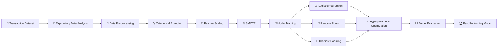
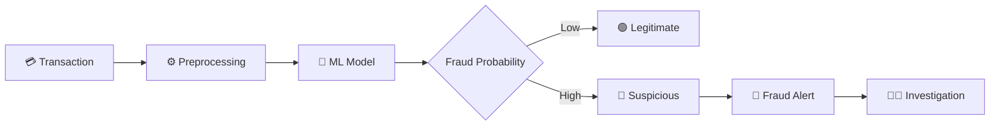

# 🛡️ Fraud Detection using Machine Learning

<p align="center">

**An end-to-end Machine Learning project for detecting fraudulent financial transactions**

<br>


</p>

---

## 🚨 Project Overview

Financial fraud is a major challenge for banking and fintech platforms. A fraud detection system must identify suspicious transactions while minimizing false alarms.

This project applies **Machine Learning classification techniques** to analyze financial transaction patterns and classify transactions as:

```text
0 → Legitimate Transaction
1 → Fraudulent Transaction
```

The project covers the complete ML workflow:

> **Data → EDA → Preprocessing → SMOTE → Model Training → Hyperparameter Optimization → Evaluation**

---

## 🎯 Objectives

- 🔍 Analyze transaction behavior and financial patterns
- 🧹 Perform data preprocessing and exploratory analysis
- ⚖️ Handle class imbalance using **SMOTE**
- 🤖 Train multiple classification algorithms
- 🔧 Optimize model hyperparameters
- 📊 Compare model performance
- 🚨 Identify fraudulent transactions
- 📈 Evaluate models using multiple classification metrics

---

# 📊 Dataset

The dataset used in the project contains:

| Property | Value |
|---|---:|
| 📌 Transactions | **11,142** |
| 📌 Features | **10** |
| 📌 Target Variable | `isFraud` |
| 📌 Numerical Features | 7 |
| 📌 Categorical Features | 3 |

### Dataset Features

| Feature | Description |
|---|---|
| `step` | Unit of simulated time, where 1 step represents 1 hour |
| `type` | Type of financial transaction |
| `amount` | Transaction amount |
| `nameOrig` | Customer initiating the transaction |
| `oldbalanceOrg` | Sender balance before transaction |
| `newbalanceOrig` | Sender balance after transaction |
| `nameDest` | Transaction recipient |
| `oldbalanceDest` | Recipient balance before transaction |
| `newbalanceDest` | Recipient balance after transaction |
| `isFraud` | Fraud classification target |

### 💳 Transaction Types

```text
CASH-IN
CASH-OUT
DEBIT
PAYMENT
TRANSFER
```

---

# 🧠 Machine Learning Pipeline



---

# 🔍 Exploratory Data Analysis

The notebook performs several stages of exploratory analysis to understand:

- Dataset dimensions
- Data types
- Missing values
- Statistical distributions
- Transaction types
- Fraud distribution
- Numerical feature relationships
- Feature correlations

### Dataset Structure

```text
11,142 Rows
      │
      ├── 9 Independent Features
      │
      └── 1 Target Feature
              │
              └── isFraud
```

---

# ⚙️ Data Preprocessing

## 1️⃣ Categorical Encoding

Categorical variables are converted into numerical representations using encoding techniques.

## 2️⃣ Feature Scaling

Numerical features are standardized using:

```python
StandardScaler()
```

## 3️⃣ Class Imbalance

Fraud detection datasets commonly contain an imbalance between legitimate and fraudulent transactions.

To address this, the project uses:

```python
SMOTE
```

### SMOTE

**Synthetic Minority Over-sampling Technique**

SMOTE creates synthetic samples for the minority class rather than simply duplicating existing observations.

```python
from imblearn.over_sampling import SMOTE

smote = SMOTE(
    sampling_strategy="auto",
    random_state=42
)

X_res, y_res = smote.fit_resample(X, y)
```

---

# 🤖 Machine Learning Models

Three classification algorithms were explored.

### 📌 Logistic Regression

Used as the baseline classification model.

```text
Purpose:
Establish a simple and interpretable baseline.
```

### 🌲 Random Forest

An ensemble learning algorithm based on multiple decision trees.

```text
Advantages:
✓ Handles nonlinear relationships
✓ Robust to complex feature interactions
✓ Ensemble-based prediction
```

### 🚀 Gradient Boosting

Sequentially builds decision trees where each new model attempts to improve previous predictions.

```text
Advantages:
✓ Strong classification performance
✓ Captures nonlinear patterns
✓ Effective ensemble technique
```

---

# 🔧 Hyperparameter Optimization

To improve model performance, the project evaluates:

### GridSearchCV

Systematically searches through predefined combinations of hyperparameters.

### RandomizedSearchCV

Randomly samples hyperparameter combinations, allowing efficient exploration of larger search spaces.

---

# 📈 Model Performance

The notebook reports the following evaluation results:

| Model | Accuracy | Precision | Recall | F1 Score |
|---|---:|---:|---:|---:|
| Logistic Regression | 96.35% | 99.56% | 92.96% | 96.15% |
| Random Forest + GridSearchCV | 99.93% | 100.00% | 99.85% | 99.92% |
| ⭐ Random Forest + RandomizedSearchCV | **99.95%** | **100.00%** | **99.90%** | **99.95%** |
| Gradient Boosting + GridSearchCV | 99.90% | 99.95% | 99.85% | 99.90% |
| Gradient Boosting + RandomizedSearchCV | 99.93% | 100.00% | 99.85% | 99.92% |

### 🏆 Best Reported Result

```text
Model      : Random Forest
Optimization : RandomizedSearchCV

Accuracy   : 99.95%
Precision  : 100.00%
Recall     : 99.90%
F1 Score   : 99.95%
```

> ⚠️ **Important:** These metrics come directly from the current notebook. The current implementation performs SMOTE before the train-test split, which can introduce data leakage. For a rigorous portfolio version, SMOTE should be applied only to the training data and the model should be evaluated again.

---

# 📊 Evaluation Metrics

The project evaluates models using:

### Accuracy

Measures the overall percentage of correctly classified transactions.

### Precision

Measures how many transactions predicted as fraud were actually fraudulent.

### Recall

Measures how many actual fraudulent transactions were detected.

### F1 Score

Harmonic mean of precision and recall.

For fraud detection, recall is particularly important because failing to detect fraudulent transactions can have financial consequences.

---

# 🔥 Confusion Matrix

The project also evaluates classification behavior using confusion matrices.

```text
                    Predicted
                 Legit      Fraud
              ┌─────────┬─────────┐
Actual Legit  │   TN    │   FP    │
              ├─────────┼─────────┤
Actual Fraud  │   FN    │   TP    │
              └─────────┴─────────┘
```

Where:

```text
TN → Correctly identified legitimate transactions
TP → Correctly identified fraudulent transactions
FP → Legitimate transaction incorrectly flagged as fraud
FN → Fraudulent transaction incorrectly classified as legitimate
```

---

# 🛠️ Technology Stack

### Programming


### Data Analysis


### Visualization


### Machine Learning


### Imbalanced Learning


### Environment


---

# 📂 Project Structure

```text
Fraud-Detection/
│
├── 📓 fraud_detection_ml.ipynb
│
├── 📁 data/
│   └── Fraud_Analysis_Dataset.csv
│
├── 📁 models/
│   └── fraud_detection_model.pkl
│
├── 📁 src/
│   ├── preprocessing.py
│   ├── train.py
│   └── predict.py
│
├── 📄 requirements.txt
│
└── 📄 README.md
```

---

# 🚀 Getting Started

## 1. Clone Repository

```bash
git clone https://github.com/YOUR_USERNAME/fraud-detection.git
```

```bash
cd fraud-detection
```

## 2. Install Dependencies

```bash
pip install pandas numpy matplotlib seaborn scikit-learn imbalanced-learn jupyter
```

## 3. Launch Notebook

```bash
jupyter notebook
```

Open:

```text
fraud_detection_ml.ipynb
```

---

# ☁️ Google Colab

You can also execute the project directly in Google Colab.

1. Open the notebook in Google Colab.
2. Upload the dataset.
3. Update the dataset path.
4. Run the notebook cells sequentially.

---

# 🔮 Future Improvements

The current project can be extended into a production-style fraud detection system.

### 🔐 Model Improvements

- [ ] Apply SMOTE only after train-test splitting
- [ ] Build an `imblearn.Pipeline`
- [ ] Stratified cross-validation
- [ ] ROC-AUC evaluation
- [ ] Precision-Recall AUC
- [ ] Threshold optimization
- [ ] Cost-sensitive learning

### 🧠 Explainable AI

- [ ] Feature importance
- [ ] SHAP explanations
- [ ] Individual transaction explanations

### 🌐 Deployment

- [ ] FastAPI prediction API
- [ ] Streamlit dashboard
- [ ] Real-time fraud prediction
- [ ] Docker deployment
- [ ] Cloud deployment

---

# 🧪 Recommended Production Architecture



---

# 📌 Key Learning Outcomes

Through this project, the following Machine Learning concepts were implemented:

```text
✓ Exploratory Data Analysis
✓ Data Cleaning
✓ Feature Analysis
✓ Categorical Encoding
✓ Feature Scaling
✓ Imbalanced Classification
✓ SMOTE
✓ Logistic Regression
✓ Random Forest
✓ Gradient Boosting
✓ Hyperparameter Optimization
✓ GridSearchCV
✓ RandomizedSearchCV
✓ Confusion Matrix
✓ Precision
✓ Recall
✓ F1 Score
```

---

# ⚠️ Project Limitation

This project uses a simulated financial transaction dataset and should be considered an educational machine learning project.

The reported model performance should not be interpreted as production-level fraud detection performance.

The current notebook's preprocessing methodology should also be improved by preventing SMOTE-generated information from entering the test set.

---

# 👨‍💻 Author

### Jamshed Ahmad

**Data Science & Machine Learning**

Skills demonstrated:

`Python` · `Machine Learning` · `Pandas` · `NumPy` · `Scikit-Learn` · `SMOTE` · `Random Forest` · `Gradient Boosting` · `Data Visualization`

---

<p align="center">

### ⭐ If you found this project useful, consider giving the repository a star!

</p>
